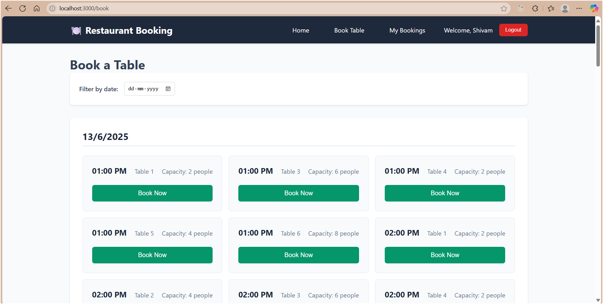
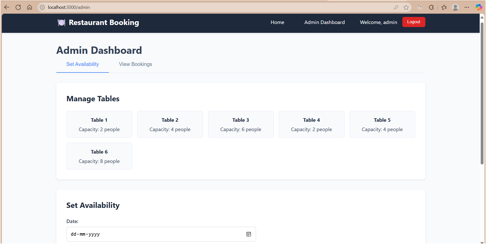

# Restaurant Table Booking App

A complete MERN stack application for restaurant table booking with admin and customer roles.  
**Developed by [Shivam Gupta](https://github.com/shivamg727583)**

> 🔗 GitHub Repository: [https://github.com/shivamg727583/Restaurant-Table-Booking](https://github.com/shivamg727583/Restaurant-Table-Booking)

---

## 📸 Screenshots

| Home Page | Admin Dashboard | Booking Page |
|-----------|-----------------|---------------|
|  |  |  |  [Admin Dashboard] (./screenshots/AdminDashboard_viewBooking.png)

> Add your own screenshots in the `screenshots/` folder and update the filenames.

---

## ✨ Features

### User Roles
- **Admin**: Set availability, view all bookings, manage tables
- **Customer**: View available slots, book tables, manage bookings

### Authentication
- JWT-based authentication
- Role-based access control
- Secure password hashing

### Backend Features
- Express.js REST API
- MongoDB with Mongoose
- Input validation
- Error handling
- CORS enabled

### Frontend Features
- React.js with Context API
- Responsive design
- Real-time booking updates
- Form validation
- Success/error notifications

---

## 🗂️ Project Structure

